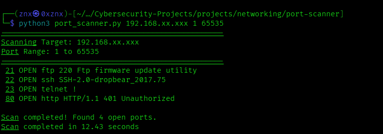

# 🔎 Port Scanner

 

A simple TCP port scanner written in Python, built as part of my cybersecurity learning journey.

This project is focused on learning the fundamentals of **Python networking, TCP connections and port scanning**.

---

## 🎯 Objectives

* Learn Python networking fundamentals (`socket` library)
* Understand how TCP connections work
* Learn how ports and services are identified
* Build a basic but functional port scanner from scratch
* Gradually improve the scanner with additional features

---

## 🚀 Features

* [x] Scan a single TCP port
* [x] Scan a range of TCP ports
* [x] Detect open vs closed ports
* [x] Handle connection timeouts gracefully
* [x] Add command-line arguments (argparse)
* [ ] Multi-threaded scanning for better performance
* [ ] Scan results logging

---

## 🛠️ Technologies

* **Python**
* **TCP/IP Protocol**
* **Socket Programming**
* **Argparse Module**

---

## 📚 What I Learned

* Python fundamentals
* Network sockets and TCP connections
* IP adresses and port management
* Error handling and timeouts
* Command-line interfaces with `argparse`
* Service identification and banner grabbin concepts

---

## ⚠️ Limitations

This is a basic TCP port scanner and currently has some limitations:

* Scanning is performed sequentially
* No multi-threading support
* Service identification is based on known port assignments
* Banner grabbing depends on the protocol being used
* UDP scanning is not supported
* Scan results cannot currently be saved to files

---
## 📜 License

This project is licensed under the MIT License.
